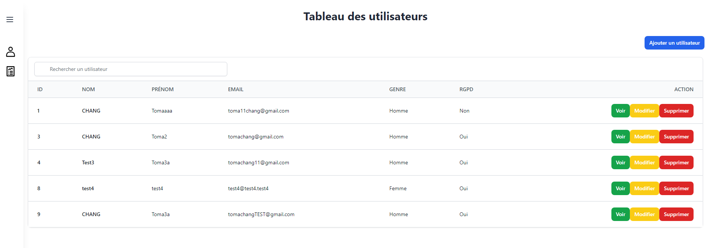

# TEST | Back-office | Lamusée - CHANG Toma

Ce projet est une application de test de back-office pour Lamusée, construite avec Symfony 7, Vue.js et stylisée avec TailwindCSS. Elle comprend une gestion des utilisateurs et utilise Docker pour gérer les bases de données MySQL et l'interface PHPMyAdmin.

## Technologies

- **Symfony 7** : Utilisé pour la logique côté serveur et le rendu.
- **Vue.js** : Gère les interactions dynamiques côté client.
- **TailwindCSS** : Fournit le style.
- **Docker** : Utilisé pour conteneuriser la base de données MySQL et l'interface PHPMyAdmin.
- **PHPMyAdmin** : Interface web pour gérer la base de données MySQL, accessible sur `localhost:8080`.

## Configuration du projet

Pour démarrer le projet sur votre machine locale, suivez ces étapes :

1. **Cloner le dépôt**
   ```bash
   git clone https://github.com/CHANG-Toma/Test-CHANG-Toma.git
   cd Test-CHANG-Toma
   ```

2. **Démarrer les conteneurs Docker**
   ```bash
   docker-compose up -d
   ```

3. **Installer les dépendances**
   ```bash
   composer install
   npm install
   npm run dev ou npm run watch
   ```

4. **Configuration de la base de données**
   Exécuter le script disponible dans le fichier SQL directement dans phpMyAdmin fourni pour peupler la base de données avec des données de test.

5. **Démarrer le serveur Symfony**
   ```bash
   symfony server:start
   ```

## Architecture

### Communication Contrôleur à Vue

Ex : 
Le contrôleur principal, `UserController`, est responsable de gérer la route vers l'index des utilisateurs. Il utilise le `UserRepository` pour récupérer toutes les données des utilisateurs, sérialise ces données en utilisant le composant Serializer de Symfony, et les passe à la vue pour le rendu.

```php
#[Route('/', name: 'app_user_index', methods: ['GET'])]
public function index(UserRepository $userRepository, SerializerInterface $serializer): Response
{
    $users = $userRepository->findAll();
    $data = $serializer->serialize(users, 'json', ['groups' => 'user']);

    return $this->render('dashboard/index.html.twig', [
        'path' => './dashboard/pages/users/users.html.twig',
        'people' => json_decode($data, true)
    ]);
}
```

### Intégration de Vue

Vue.js est utilisé pour améliorer l'interactivité de l'interface utilisateur. Il gère dynamiquement des composants comme les barres latérales et les zones de contenu.

```html


Back-office | Lamusée


<div id="app">
    <Sidebar @toggle-sidebar="toggleSidebar" :is-open="isSidebarOpen"></Sidebar>
    <Content :is-sidebar-open="isSidebarOpen">
        
    </Content>
</div>

```

### Variable `path`

La variable `path` dans le contrôleur Symfony transmet le chemin spécifique du template Twig qui doit être inclus dans la mise en page du composant principal Vue.js de manière dynamique. Cette méthode permet un rendu flexible de différentes parties de l'application en fonction de la gestion des routes.

## Notes supplémentaires

- **Fichier SQL** : Un fichier SQL contenant des données de test est inclus. Le script SQL doit être exécuter dans votre configuration de base de données MySQL.
- **Note SQL** : Le script SQL n'est pas obligatoire d'etre exécuté, il contient uniquement des données de test. Dans le cas ou, vous ne l'exécuté pas, il faudra migrer via Doctrine directement.
- **PHPMyAdmin** : Accédez à PHPMyAdmin à l'adresse `http://localhost:8080` pour gérer directement votre base de données via une interface web.

## Licence
Ce projet est sous licence MIT

```sh
php bin/console server:run


```
